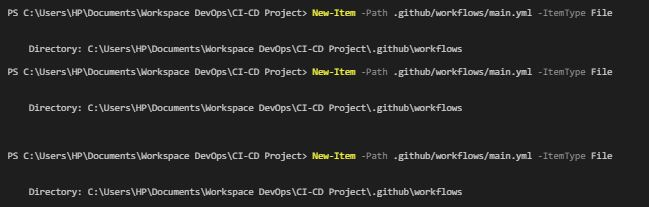
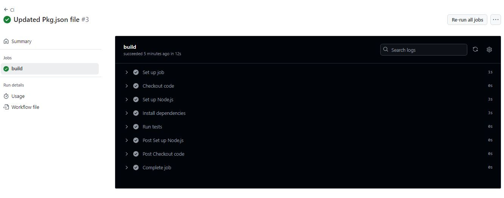

# **GitHub Actions Lab Guide**

- Objective; Learn how to set up and use GitHub Actions to automate workflows, including running tests, building applications, and deploying code.

# Prerequisites

- A GitHub account
- A repository to work with

# **Step 1: Create a New GitHub Repository**

- Go to GitHub and create a new repository.
- Initialize the repository with a README.md file.
- Clone the repository to your local machine
  CI-CD-Course-Project/CI-CD-MODULE/images/step1.JPG
  

# **Step 2: Create a Workflow Directory**

- Create a directory for your GitHub Actions workflows:
  mkdir -p .github/workflows
  

# **Step 3: Create a Simple Workflow**

- Commit and push the workflow file to your repository:

git add .github/workflows/main.yml
git commit -m "Add initial GitHub Actions workflow"
git push origin main

# **Step 4: Trigger the Workflow**

- Make a change to your repository and push it to trigger the workflow.
  Go to the "Actions" tab in your GitHub repository to see the running workflow.
  

# **Step 5: Create a Workflow with Multiple Jobs**

# **Step 6: Use Secrets in Your Workflow**

